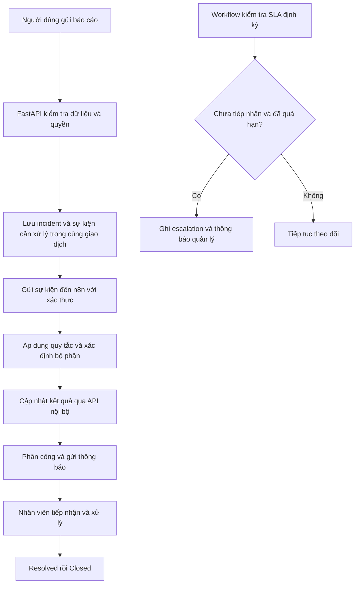

# Campus Incident Management

Campus Incident Management là dự án nhóm xây dựng nền tảng web tiếp nhận, phân công và theo dõi sự cố an toàn, an ninh trong khuôn viên trường đại học. Dự án sử dụng các quy tắc định sẵn để đánh giá mức độ nghiêm trọng, xác định độ ưu tiên và chuyển sự cố đến bộ phận phụ trách; n8n điều phối các workflow thông báo và theo dõi thời hạn phản hồi.

Tên đề tài trong proposal: **Campus Incident Management**. Chuyên ngành: **Cyber Security**, University of Science and Technology of Hanoi (USTH).

> **Trạng thái:** Đã có nền móng phát triển: React/TypeScript, FastAPI health API, SQLAlchemy/Alembic cho users/departments và Docker Compose. Chưa triển khai đăng nhập, incident, rules, SLA hoặc workflow nghiệp vụ. Phạm vi nghiệp vụ bên dưới vẫn là thiết kế đề xuất.

## Tài liệu dự án

- [Bảng phân công việc làm mỗi tuần](docs/KE_HOACH_CONG_VIEC.md)
- [Thiết lập và chạy dự án](docs/development.md)
- [Kiến trúc](docs/architecture.md) · [Yêu cầu](docs/requirements.md) · [API contract](docs/api-contract.md)
- [Đặc tả nghiệp vụ phần A](docs/phan-a-yeu-cau-nghiep-vu.md)
- [Kế hoạch kiểm tra](docs/test-plan.md)
- [Bảo mật](SECURITY.md)
- [Workflow n8n mẫu](workflows/README.md)

Kế hoạch giao cố định một mảng cho mỗi vị trí N1–N7: tài khoản/quyền, tiếp nhận/dữ liệu, phân loại/SLA, vòng đời xử lý, n8n/thông báo, giao diện người báo và giao diện nhân viên. Cả 7 mảng bắt đầu từ 12/10/2026 bằng API contract và fixture/mock, ghép nối theo mốc chung, hoàn tất mã nguồn và kiểm thử trước 04/01/2027. Tên thành viên được nhập trong file Excel phân công; tài liệu kế hoạch dùng mã N1–N7 để không phụ thuộc tên.

## Mục tiêu

- Cho phép sinh viên và nhân viên gửi báo cáo, cung cấp vị trí, mô tả và bằng chứng.
- Giúp nhân viên tiếp nhận đúng sự cố thuộc phạm vi trách nhiệm.
- Tự động đánh giá và phân công theo quy tắc có thể kiểm tra, giải thích.
- Theo dõi tiến độ, lịch sử xử lý và thời hạn phản hồi.
- Bảo vệ thông tin báo cáo thông qua phân quyền, kiểm soát dữ liệu và nhật ký hoạt động.
- Đánh giá hiệu quả bằng các tình huống kiểm thử có kết quả kỳ vọng.


### MVP đề xuất

MVP là bản tối thiểu có thể chạy xuyên suốt từ tiếp nhận đến đóng sự cố.

| Hạng mục | Phạm vi MVP |
| --- | --- |
| Loại sự cố | Rò nước, nguy hiểm điện và phishing |
| Tiếp nhận | Người dùng đăng nhập và gửi báo cáo bằng form có câu hỏi theo loại sự cố |
| Phân tích | Quy tắc định sẵn; lưu lý do đánh giá và phiên bản quy tắc |
| Phân công | Chuyển đến bộ phận; người phụ trách bộ phận nhận hoặc phân công nhân viên |
| Theo dõi | Danh sách, chi tiết, lọc, ghi chú, lịch sử và chuyển trạng thái |
| Thông báo | Email khi tiếp nhận, phân công hoặc có sự cố ưu tiên cao |
| SLA | Theo dõi thời hạn tiếp nhận và cảnh báo khi chưa tiếp nhận đúng hạn |
| Bảo mật | Kiểm tra quyền ở backend, bảo vệ file, xác thực webhook và audit log |
| Triển khai | Docker Compose trong môi trường phát triển/demo |

### Giai đoạn mở rộng

- Bổ sung hư hỏng cơ sở vật chất, đăng nhập đáng ngờ và truy cập trái phép.
- Theo dõi SLA giải quyết, lịch làm việc và thống kê nâng cao.
- Tích hợp nguồn log để tiếp nhận sự kiện tự động khi nhóm đã xác định được nguồn dữ liệu và quyền truy cập.

MVP tiếp nhận **báo cáo do người dùng gửi**. Việc tự phát hiện tấn công từ log chưa thuộc phạm vi MVP. Với tình huống có nguy hiểm tức thời, giao diện cần hướng dẫn liên hệ đầu mối khẩn cấp được trường xác nhận; ứng dụng không được coi là kênh ứng cứu khẩn cấp duy nhất.

## Vai trò và quyền truy cập

| Vai trò | Quyền dự kiến |
| --- | --- |
| Reporter | Tạo báo cáo, xem báo cáo của mình, bổ sung thông tin, xem cập nhật được phép công khai |
| Handler | Xem và xử lý sự cố được giao; ghi chú nội bộ, xác nhận tiếp nhận và đề xuất giải quyết |
| Department Manager | Xem sự cố của bộ phận, phân công lại, điều chỉnh ưu tiên có lý do, xác nhận đóng hoặc mở lại |
| Administrator | Quản lý tài khoản, bộ phận, cấu hình hệ thống và quy tắc; quyền đọc dữ liệu sự cố phải được cấp rõ ràng |

Backend phải kiểm tra quyền trên từng bản ghi và file đính kèm. Việc ẩn nút trên giao diện không thay thế kiểm tra quyền. Người báo không được xem ghi chú nội bộ hoặc nội dung của báo cáo khác.

## Luồng xử lý



### Vòng đời sự cố

| Trạng thái | Ý nghĩa | Điều kiện chuyển tiếp dự kiến |
| --- | --- | --- |
| Reported | Báo cáo đã được lưu, đang chờ đánh giá/phân công | Có kết quả phân loại và bộ phận phụ trách để chuyển sang Assigned |
| Assigned | Đã có bộ phận hoặc nhân viên phụ trách | Người xử lý xác nhận tiếp nhận để chuyển sang In Progress |
| In Progress | Đã tiếp nhận và đang xử lý | Có mô tả kết quả xử lý để chuyển sang Resolved |
| Resolved | Người xử lý đã ghi kết quả | Quản lý xác nhận để chuyển sang Closed; trả lại In Progress nếu chưa đạt |
| Closed | Quá trình xử lý đã được xác nhận hoàn tất | Chỉ quản lý được mở lại về In Progress, kèm lý do |

Mỗi lần chuyển trạng thái phải lưu người thực hiện, thời gian, trạng thái trước/sau và lý do khi cần. Sự cố bị báo trùng, không hợp lệ hoặc không xác định được bộ phận cần quy trình xử lý riêng được nhóm thống nhất, có lịch sử và người chịu trách nhiệm.

## Phân loại và ưu tiên

**Severity** biểu thị mức độ tác động. **Priority** biểu thị thứ tự cần xử lý dựa trên tác động và tính cấp bách. Chúng là hai trường riêng.

| Tình huống mẫu | Kết quả đề xuất | Bộ phận đề xuất |
| --- | --- | --- |
| Rò nước nhỏ, không gần nguồn điện | Severity Low, Priority P3 | Cơ sở vật chất |
| Rò nước gần thiết bị điện | Severity High, Priority P1 | Cơ sở vật chất và đầu mối an toàn |
| Dây điện hở, có khói hoặc tia lửa | Severity Critical, Priority P1 | Đầu mối điện/an toàn |
| Nhận email nghi phishing, chưa tương tác | Severity Low, Priority P3 | IT/Security |
| Đã nhập mật khẩu vào trang nghi phishing | Severity High, Priority P1 | IT/Security |

Đây là dữ liệu minh họa để thảo luận, không phải quy trình chính thức của trường. Tên bộ phận, quy tắc, thứ tự ưu tiên và ngưỡng SLA phải được xác nhận trước khi sử dụng thực tế. Các báo cáo thiếu dữ liệu hoặc không khớp quy tắc cần đưa về hàng chờ đánh giá thủ công.

## SLA và escalation

- SLA tiếp nhận bắt đầu tại `reported_at`, kết thúc tại `acknowledged_at` khi người xử lý nhận sự cố.
- `assigned_at` không đồng nghĩa với đã tiếp nhận.
- Baseline demo đặt ngưỡng P1 = 15 phút, P2 = 2 giờ, P3 = 8 giờ trong [đặc tả phần A](docs/phan-a-yeu-cau-nghiep-vu.md); đây không phải cam kết phản hồi của trường.
- MVP đề xuất tính thời gian liên tục; SLA theo giờ làm việc để giai đoạn mở rộng.
- n8n kiểm tra các bản ghi đủ điều kiện, tạo escalation một lần cho mỗi mức và thông báo đầu mối phụ trách.
- Workflow phải xử lý trường hợp người xử lý tiếp nhận đúng lúc job kiểm tra SLA đang chạy.
- Lưu thời gian ở UTC, hiển thị theo múi giờ cấu hình; demo dự kiến sử dụng `Asia/Ho_Chi_Minh`.

## Kiến trúc đề xuất

| Thành phần | Công nghệ trong proposal | Trách nhiệm |
| --- | --- | --- |
| Frontend | React / TypeScript | Form báo cáo, màn hình theo dõi và dashboard theo vai trò |
| Backend | Python / FastAPI | Xác thực, phân quyền, kiểm tra dữ liệu, quản lý vòng đời, API nghiệp vụ và API nội bộ |
| Database | PostgreSQL | Dữ liệu sự cố, phân công, lịch sử, thông báo, SLA và audit |
| Workflow | n8n | Điều phối phân loại, gọi API cập nhật, thông báo, retry và escalation |
| Deployment | Docker / Docker Compose | Môi trường phát triển và demo có thể tái tạo |

Backend là nơi kiểm soát các thay đổi dữ liệu và trạng thái. n8n gọi API nội bộ được xác thực để cập nhật sự cố; không tùy ý ghi trực tiếp vào bảng nghiệp vụ. Bộ quy tắc nên có một nguồn định nghĩa và phiên bản duy nhất, tránh frontend/backend/n8n cho kết quả khác nhau.

Phương án độ tin cậy đề xuất: lưu incident cùng sự kiện trong một giao dịch, sau đó chuyển sự kiện đến n8n. Dùng `event_id`/khóa idempotency để workflow chạy lại không tạo phân công, lịch sử hoặc thông báo trùng. Phản hồi tạo báo cáo thành công có nghĩa dữ liệu đã được lưu; trạng thái xử lý tự động được theo dõi riêng. Cơ chế gửi email cần xét trường hợp nhà cung cấp đã nhận thư nhưng ứng dụng chưa ghi nhận thành công.

## Mô hình dữ liệu dự kiến

| Nhóm dữ liệu | Nội dung chính |
| --- | --- |
| Users / Roles / Memberships | Tài khoản, vai trò và phạm vi bộ phận |
| Departments | Bộ phận và đầu mối nhận sự cố |
| Incidents | Người báo, loại, vị trí, mô tả, severity, priority, trạng thái và các mốc thời gian |
| Attachments | Metadata file, chủ sở hữu, incident và vị trí lưu trữ được bảo vệ |
| Assignments | Bộ phận, người xử lý và lịch sử phân công |
| Comments | Trao đổi với người báo hoặc ghi chú nội bộ |
| Status History / Audit Logs | Chuyển trạng thái và các thao tác cần truy vết |
| Rules / Rule Evaluations | Quy tắc, phiên bản và lý do đánh giá |
| SLA Policies / Escalations | Ngưỡng phản hồi và các lần chuyển cấp |
| Notifications | Người nhận, loại thông báo, kết quả gửi và retry |
| Outbox Events / Workflow Runs | Sự kiện chờ gửi, lần chạy workflow và lỗi xử lý |

## Yêu cầu bảo mật

- Chọn cơ chế đăng nhập, quản lý session/token và đăng xuất; không xây nhiều cơ chế song song trong MVP.
- Kiểm tra quyền theo vai trò, bộ phận, người được giao và chủ sở hữu bản ghi.
- Không cung cấp URL công khai để tải bằng chứng nhạy cảm.
- Giới hạn dung lượng, loại file, số file và tổng dung lượng; kiểm tra cả nội dung và đuôi file.
- Chặn truy cập đường dẫn tùy ý, nội dung script và dữ liệu đầu vào không hợp lệ.
- Xác thực webhook/API nội bộ; thiết kế chống gửi lại sự kiện cũ và giới hạn quyền service account.
- Giới hạn tần suất đăng nhập, tạo báo cáo và tải file theo chính sách thống nhất.
- Không commit mật khẩu, token, file `.env`, log nhạy cảm hoặc bằng chứng thật của người dùng.
- Che thông tin nhạy cảm trong log; hạn chế quyền đọc audit log và quản trị n8n.
- Dùng HTTPS ở môi trường công khai; cấu hình CORS theo origin được phép.
- Chốt chính sách lưu giữ/xóa dữ liệu và kiểm tra backup/restore trước khi dùng dữ liệu thật.

## Cấu trúc repository hiện tại

```text
.
├── backend/
│   ├── app/                 # FastAPI, config, DB và identity models
│   ├── migrations/          # Alembic và revision đầu tiên
│   ├── tests/               # Health/CORS tests
│   ├── requirements*.txt    # Dependencies cố định
│   └── Dockerfile
├── frontend/                # React + TypeScript + Vite
├── workflows/               # Workflow health check mẫu, inactive
├── scripts/                 # Tạo .env local không ghi đè
├── docs/                    # Kế hoạch, kiến trúc, API, hướng dẫn và test
├── compose.yaml
├── .env.example
├── SECURITY.md
└── README.md
```

## Chạy dự án

Yêu cầu Docker Desktop/Engine đang chạy với Linux containers. Từ thư mục gốc:

```powershell
powershell -ExecutionPolicy Bypass -File scripts/init-env.ps1
docker compose config --quiet
docker compose up --build -d --wait
powershell -ExecutionPolicy Bypass -File scripts/verify-docker.ps1
```

| Thành phần | Địa chỉ local |
| --- | --- |
| Frontend | http://localhost:5173 |
| FastAPI docs | http://localhost:8000/docs |
| HTTP health | http://localhost:8000/api/v1/health/live |
| Database readiness | http://localhost:8000/api/v1/health/ready |
| n8n | http://localhost:5678 |

PostgreSQL được truy cập trên máy qua `localhost:15432`; cổng trong mạng Docker vẫn là `5432`. Có thể đổi cổng máy qua `POSTGRES_PORT` trong `.env`. Compose tự chạy migration trước backend. Truy cập n8n lần đầu để tạo owner account; chưa có tài khoản demo hoặc đăng nhập ứng dụng. Frontend hiện hiển thị trạng thái HTTP API, chưa có form báo cáo.

**Đã xác minh Docker local:** build và khởi động thành công; PostgreSQL, backend, frontend và n8n đều healthy; migration hoàn tất với exit code 0; `alembic check` xác nhận schema khớp model. HTTP health, proxy frontend và kết nối n8n → backend đạt. Workflow health check mẫu đã import và chạy thành công. Nghiệp vụ incident/auth chưa triển khai.

Xem [hướng dẫn phát triển](docs/development.md) để chạy frontend/backend trực tiếp bằng Node.js 24/Python 3.14, kiểm thử, cấu hình proxy và xử lý lỗi. Compose hiện dùng dev server, chỉ dành cho localhost.

## Kiểm tra nhanh

```powershell
# Từ frontend/
npm ci
npm run lint
npm run build

# Từ backend/ sau khi tạo .venv
.venv/Scripts/python.exe -m pip install -r requirements-dev.txt
.venv/Scripts/ruff.exe check .
.venv/Scripts/ruff.exe format --check .
.venv/Scripts/python.exe -m pytest -q
```

Không commit `.env`, token hoặc credentials. Script tạo `.env` có thể chạy nhiều lần mà không thay key đã tồn tại.

## Kiểm thử và đánh giá

- Unit test các quy tắc, tính deadline và chuyển trạng thái.
- Integration test API, PostgreSQL và n8n.
- E2E ba loại sự cố MVP từ gửi báo cáo đến đóng.
- Kiểm thử quyền bằng cách gọi API trực tiếp, đổi ID incident/file và dùng tài khoản khác bộ phận.
- Kiểm thử webhook bị giả mạo, sự kiện trùng, workflow lỗi, email lỗi và restart dịch vụ.
- Kiểm tra SLA ở trước/đúng/sau deadline và khi có thao tác đồng thời.
- Đo tỷ lệ phân loại/phân công đúng, thời gian phân công, kết quả escalation và khả năng phục hồi.

Dùng bộ tình huống có kết quả kỳ vọng được thống nhất trước. Báo cáo số lượng mẫu, điều kiện chạy và lỗi còn tồn tại; không suy rộng kết quả demo thành hiệu quả vận hành thực tế.

## Tài liệu công nghệ tham khảo

- [Vite Getting Started](https://vite.dev/guide/)
- [FastAPI trong Docker](https://fastapi.tiangolo.com/deployment/docker/)
- [n8n Docker installation](https://docs.n8n.io/deploy/host-n8n/install-options/install-with-docker.md)

=======
