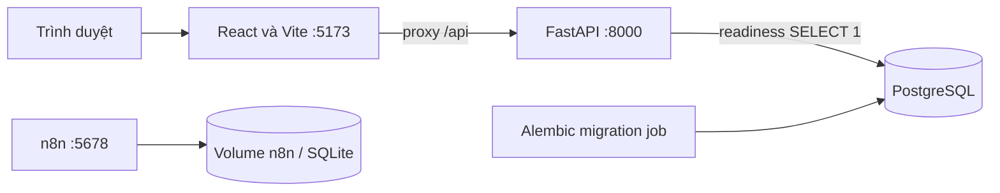

# Kiến trúc nền móng và hướng phát triển

## Đã hiện thực

Backend có liveness/readiness, cấu hình CORS giới hạn, kết nối SQLAlchemy và model/migration `users`, `departments`. Chưa có API tài khoản hoặc incident. Database được quản lý bằng Alembic, không tạo bảng tự động khi API chạy.

n8n hiện tách biệt với dữ liệu ứng dụng. Workflow health check mẫu đã import và chạy thành công; chưa có luồng báo cáo/phân công/thông báo.

## Ranh giới trách nhiệm khi triển khai nghiệp vụ

- Frontend hiển thị và nhập dữ liệu; backend là nơi kiểm tra quyền và quy tắc chuyển trạng thái.
- Backend ghi incident và outbox trong cùng giao dịch, cung cấp API nội bộ cho workflow.
- n8n điều phối qua API; không trực tiếp cập nhật bảng nghiệp vụ.
- PostgreSQL giữ dữ liệu nghiệp vụ. SQLite nội bộ của n8n chỉ giữ workflow/credentials/execution trong bản local starter.
- Service credentials, kiểm tra webhook/replay và outbox worker chưa được triển khai. Chỉ mở endpoint nội bộ sau khi các phần này có kiểm thử.

## Thiết kế đã chốt cho demo và giới hạn hiện tại

Phạm vi ba loại, ma trận quyền và ngưỡng SLA demo đã được đề xuất trong [đặc tả phần A](phan-a-yeu-cau-nghiep-vu.md). [API contract](api-contract.md) đã chọn bearer session lưu hash ở backend, event/outbox, mã lỗi và luồng n8n; đây là **thiết kế chưa được lập trình**. Trước vận hành thật vẫn cần xác nhận quy trình trường, đầu mối khẩn cấp và chính sách dữ liệu. Cấu trúc bảng, chính sách file thực thi và retry cần triển khai theo kế hoạch. Migration identity ban đầu sử dụng một role/bộ phận cho mỗi user; nếu cần nhiều membership, thêm migration thay vì sửa revision đã áp dụng.

Compose chỉ dành cho localhost. Khi triển khai production cần reverse proxy/static frontend, HTTPS, quản lý secrets, backup, giới hạn tài nguyên và cấu hình log phù hợp.
